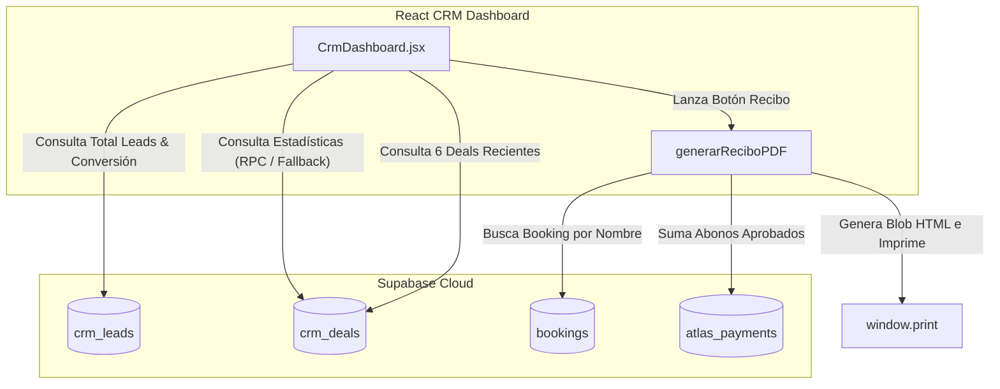

# Auditoría y Funcionamiento: CRM Dashboard (Métricas y Recibos)

Este documento detalla el funcionamiento, la arquitectura y las relaciones del **Dashboard del CRM** de ATLAS (`atlas-admin-v2`), ubicado en la ruta `/crm/dashboard`.

---

## Ecosistema del Dashboard de CRM

El Dashboard procesa y consolida las métricas financieras del funnel comercial del CRM cruzando leads, tratos (`crm_deals`) y cobros reales en Supabase.

---

## 📊 KPIs y Métricas de Rendimiento Comercial

El dashboard renderiza cuatro indicadores clave de rendimiento (KPIs) en tiempo real:

1. **Total Leads:** Conteo exacto de filas en `crm_leads`.
2. **Valor Funnel Activo:** Suma de `total_usd` de los tratos en `crm_deals` con estado `'pendiente'`.
3. **Ventas Confirmadas:** Suma de `total_usd` de los tratos en `crm_deals` con estado `'confirmada'` o `'depositado'`.
4. **Conversión Final:** Relación porcentual de leads en etapa `'confirmada'` frente al total acumulado de leads.

### Mecanismo de Consulta (RPC & Fallback Cliente)
* **Llamada Principal:** Llama a la función de Supabase `crm_pipeline_stats()`.
* **Llamada de Fallback (Cliente):** Si la RPC no existe o da error, el componente ejecuta de forma reactiva agregaciones en el cliente:
  * Agrupa y cuenta leads por estado mediante `.select('stage')` de `crm_leads`.
  * Clasifica y suma los montos financieros mediante `.select('status, total_usd')` de `crm_deals`.

---

## 🧾 Generación Dinámica de Recibos y Cruce de Pagos

Una de las funcionalidades core de `/crm/dashboard` es la capacidad de generar y guardar recibos oficiales del cliente en PDF a partir de una cotización/trato reciente.

### Flujo Técnico del Recibo:
1. **Handshake de Reserva:** Al hacer clic en el botón **"Recibo"** de un trato, la función `generarReciboPDF` realiza una consulta de aproximación de texto (`ilike`) en la tabla `bookings` buscando el primer nombre del lead en la columna `lead_guest_name`.
2. **Conciliación Financiera (Abonos):** Si encuentra la reserva vinculada, el script consulta de inmediato la tabla `atlas_payments` sumando todos los abonos aprobados (`status = 'approved'`) del `booking_id`.
3. **Cálculo de Balance:** Calcula el saldo pendiente: `balance = total_amount - abonos_aprobados`.
4. **Template HTML y Print Blob:**
   * Monta un template HTML autocontenido con los estilos corporativos de Aliun Travel (Navy y Gold).
   * Genera un Object URL a partir de un Blob de HTML y abre una pestaña de navegador limpia con una llamada a `window.print()` para descargar o imprimir el recibo.
