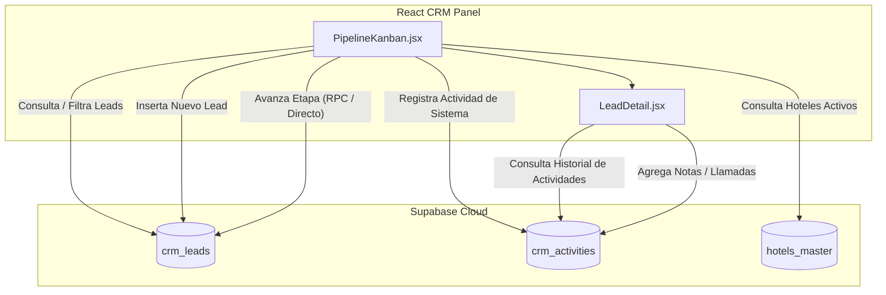

# Auditoría y Funcionamiento: CRM Interno (Pipeline Kanban)

Este documento detalla el funcionamiento, la arquitectura y las relaciones del **CRM Interno** de ATLAS (`atlas-admin-v2`), ubicado en la ruta `/crm/pipeline`.

---

## Ecosistema del CRM Interno

El CRM de ATLAS es 100% nativo y opera directamente sobre la base de datos de Supabase, eliminando dependencias de plataformas externas como Kommo. 

---

## Estructura del Pipeline y Etapas

Las columnas del Kanban están definidas estáticamente en el componente en base al campo `stage` de la tabla `crm_leads`:

1. **Nuevo (`nuevo`):** Leads recién registrados por el cliente (Widget) o manuales.
2. **Contactado (`contactado`):** El agente comercial ya inició conversación.
3. **Cotizado (`cotizado`):** Se le envió presupuesto formal de hotel/paquete.
4. **Negociando (`negociando`):** En discusión de precios y formas de pago.
5. **Confirmada (`confirmada`):** Venta cerrada con éxito (pasa a ser reserva).
6. **Perdido (`perdido`):** Lead descartado.

---

## 🛠️ Flujos Técnicos Operativos

### 1. Creación de Nuevos Leads
Cuando un administrador registra un lead manualmente desde el modal "Nuevo Lead":
* **Tabla Afectada:** `public.crm_leads`
  * Inserta un nuevo registro con los campos: `full_name`, `phone`, `email`, `source` (fuentes: `'manual'`, `'whatsapp'`, `'widget'`, `'referral'`, `'meta_ad'`), `hotel_interest` (FK de slug de hotel), `budget_range` y `message`. El estado inicial es por defecto `stage: 'nuevo'`.
* **Tabla Afectada (Historial):** `public.crm_activities`
  * Inserta una actividad inicial del sistema indicando: `"Lead creado manualmente desde el Panel de Horizons"`, con `created_by: 'director'`.

### 2. Transición y Movimiento de Etapas (Drag & Drop)
Al arrastrar una tarjeta de Lead de una columna a otra en el Kanban:
1. **Actualización Optimista:** El estado de React (`leads`) se actualiza localmente de inmediato para una experiencia de usuario instantánea y fluida.
2. **Lógica de Persistencia (Supabase):**
   * **Intento A (RPC):** Llama al procedimiento almacenado de Supabase `avanzar_pipeline(p_lead_id, p_new_stage, p_actor)`. Esto permite ejecutar validaciones adicionales o triggers en la base de datos de manera centralizada.
   * **Intento B (Fallback Directo):** Si la RPC no existe o falla, el frontend ejecuta una actualización directa a la tabla `crm_leads` filtrando por el ID y cambiando la columna `stage`.
   * **Historial de Movimiento:** Tras la actualización exitosa, el frontend inserta una actividad en `crm_activities` con el contenido: `"Etapa del pipeline cambiada manualmente a: {stageId}"`.

### 3. Vista de Detalle y Seguimiento (LeadDetail.jsx)
Al hacer clic en una tarjeta de Lead:
* Abre un panel lateral deslizante (`LeadDetail`) que:
  * Consulta el historial completo de actividades de la tabla `crm_activities` asociadas al `lead_id`.
  * Permite registrar interacciones manuales (tipo: `nota`, `llamada`, `whatsapp`, `email`) que se guardan en `crm_activities` para mantener la bitácora de seguimiento comercial de cada cliente.
