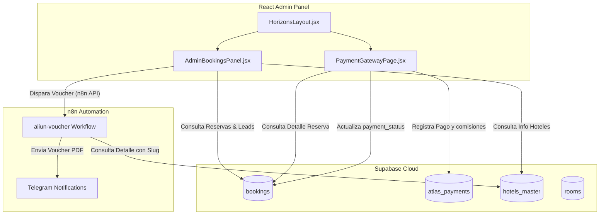

# Auditoría y Mapa de Componentes: Motor de Reservas y Pagos

Este documento detalla la arquitectura, relaciones de componentes y el flujo de datos del **Motor de Ingresos y Reservas** de ATLAS (`atlas-admin-v2`), centrándose en la vista de administración `/admin/bookings` y la pasarela de gestión de pagos `/admin/payments/:bookingRef`.

## Resumen del Ecosistema del Motor de Ingresos

El Motor de Ingresos conecta de forma síncrona el frontend administrativo, la base de datos central de Supabase, el CRM (Kommo/Kanban) y el orquestador de workflows de n8n para la emisión de vouchers y alertas de Telegram.

---

## Mapeo Detallado de Componentes

### 1. Layout Maestro y Navegación
* **Componente:** HorizonsLayout.jsx
  * **Rol:** Proveer el Sidebar lateral y la estructura general del panel.
  * **Opciones del Menú conectadas a Reservas:**
    * **Reservas Hoteles 🏨** (`href: '/admin/bookings'`)
    * **Acciones Rápidas ⚡** (`href: '/'`)

### 2. Panel Principal de Reservas
* **Componente:** AdminBookingsPanel.jsx
  * **Ruta en React Router:** `/admin/bookings`
  * **Sub-Módulos y Tarjetas de Métricas Internas:**
    1. **Cards de Facturación:**
       * *Total Facturado:* Suma de `total_price` de reservas con estado `confirmed`.
       * *Ingresos Pendientes:* Suma de montos donde `payment_status != 'paid'`.
    2. **Filtros y Búsqueda:** Búsqueda reactiva por texto (cliente, referencia) y selectores por estado de pago.
    3. **Tabla de Reservas:** Lista paginada con botones de acción rápida por fila.
  * **Conexión de Botones (Botonera de Fila):**
    * **Botonera "Gestionar Pago":** Redirige internamente vía `useNavigate` a `/admin/payments/${booking.booking_ref}`.
    * **Botonera "Ver CRM":** Redirige a `/crm/pipeline?search=${booking.client_name}` para buscar al cliente en el pipeline de ventas.
    * **Botonera "Voucher (Enviar)":** Realiza un fetch HTTP POST al webhook del workflow `aliun-voucher` en n8n enviando el ID de la reserva y el `slug` del hotel.
    * **Botonera "Editar":** Despliega modal interno para corregir fechas de check-in/out, nombres de huéspedes o pasaportes.

### 3. Pasarela de Gestión de Pagos
* **Componente:** PaymentGatewayPage.jsx
  * **Ruta en React Router:** `/admin/payments/:bookingRef`
  * **Secciones de Interfaz:**
    1. **Resumen de Compra:** Muestra el hotel (cargando su foto de portada `about_image`), fechas de estadía, habitación, y el desglose de precios (Tarifa Total Cliente, Tarifa Neta Proveedor y Markup).
    2. **Historial de Transacciones:** Tabla con los registros de la tabla `atlas_payments` vinculados al `booking_id` de la reserva.
    3. **Formulario de Registro de Pago:** Formulario para registrar un abono/pago manual de la reserva.
  * **Flujo Operativo al Guardar Pago:**
    1. Inserta el abono en `atlas_payments` con el ID de transacción, moneda, monto y método de pago.
    2. Consulta la suma de todos los abonos aprobados para la reserva.
    3. Si la suma de abonos es >= `total_price`, actualiza `payment_status` de la tabla `bookings` a `'paid'`. Si es parcial, a `'partial'`.
    4. Redirige de vuelta al panel de reservas.

---

## Esquema y Relaciones de Base de Datos (Supabase)

El motor de ingresos se sustenta en tres tablas clave en Supabase:

### A. Tabla `public.bookings` (Cabecera de Reserva)
* Almacena el contrato comercial y estado de la reserva.
* **Campos clave consultados en `/admin/bookings`:**
  * `id` (UUID - Primary Key)
  * `booking_ref` (Text - Código legible ej. `ALN-CG-002`)
  * `client_name`, `client_email`, `client_phone` (Text)
  * `total_price` (Numeric - Precio cobrado al cliente)
  * `net_price` (Numeric - Costo del hotel/proveedor)
  * `payment_status` (Text - `'pending'`, `'partial'`, `'paid'`)
  * `status` (Text - `'confirmed'`, `'cancelled'`)
  * `hotel_id` (UUID - FK a `hotels_master`)
  * `room_id` (UUID - FK a `rooms`)

### B. Tabla `public.atlas_payments` (Registro Relacional de Abonos)
* Almacena cada transacción individual de cobro asociada a la reserva.
* **Campos clave:**
  * `id` (UUID - Primary Key)
  * `booking_id` (UUID - Clave foránea dura a `bookings.id`)
  * `booking_ref` (Text - Referencia de la reserva)
  * `amount` (Numeric - Monto del abono realizado)
  * `currency` (Text - `'USD'` o `'DOP'`)
  * `payment_method` (Text - `'Azul'`, `'PayPal'`, `'Transferencia'`)
  * `transaction_id` (Text - ID de referencia bancario)
  * `status` (Text - `'approved'`, `'pending'`)

### C. Tabla `public.hotels_master` (Diccionario de Hoteles)
* Aporta la información del hotel reservado.
* **Campos clave:**
  * `id` (UUID - Primary Key)
  * `name` (Text)
  * `slug` (Text - Usado para armar vouchers en n8n)
  * `about_image` (Text - URL de la imagen principal / portada del hotel)

---

## Puntos de Integración con Terceros y Automatización

1. **Workflow `aliun-voucher` (n8n):**
   * **Entrada:** Recibe el `booking_id` y el `slug` del hotel desde la botonera de `AdminBookingsPanel.jsx`.
   * **Proceso:** Consulta la reserva en Supabase, extrae la imagen de portada `about_image` de `hotels_master` usando el `slug`, arma el PDF del voucher en PDFMonkey y envía el PDF al cliente y una alerta con la imagen a Telegram.
2. **Embudo de Ventas (Kommo CRM):**
   * El botón "Ver CRM" abre `/crm/pipeline?search=...`, el cual extrae los leads de la tabla `crm_leads` en Supabase y los filtra reactivamente en la vista Kanban para que los agentes comerciales den seguimiento.
