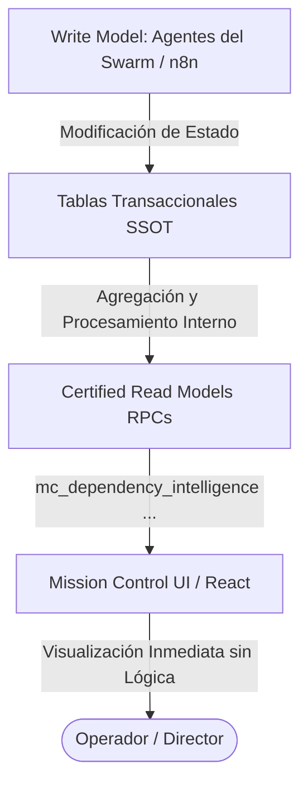

# Familia de Arquitectura MC-RM — Read Models de Mission Control
**Ecosistema:** ATLAS
**Estatus:** HITO ARQUITECTÓNICO APROBADO ✅
**Última actualización:** 30 Jul 2026

---

## 📌 1. Propósito y Filosofía
La familia **MC-RM (Mission Control Read Models)** formaliza la separación absoluta entre la ejecución del negocio y la presentación visual en el ecosistema ATLAS. 

Anteriormente, el panel administrativo (Mission Control) actuaba como un cliente tradicional que realizaba consultas agregadas y cálculos de lógica de negocio directamente sobre tablas operativas. Esto generaba acoplamiento, lentitud en consultas complejas y riesgo de inconsistencias.

Bajo el patrón MC-RM, **la interfaz de usuario de Mission Control es un mero consumidor pasivo de Read Models certificados**. Toda la lógica de agregación, cálculo de estados, árboles de dependencias y telemetría es procesada y resuelta en el plano del motor de datos (Supabase/PostgreSQL) y expuesta a través de funciones RPC optimizadas.

---

## ⚠️ 2. Regla Constitucional de Datos

> ### 🛑 Regla MC-RM-001
> **Todo componente o widget del panel Mission Control consume exclusivamente Read Models certificados (funciones RPC de la familia `mc_*`). Queda estrictamente prohibido realizar consultas directas sobre tablas transaccionales u operativas (como `atlas_tasks` o `logs_operativos`) desde la UI para computar métricas o estados.**
>
> *Razón:* Mantener desacoplada la presentación, evitar fugas de lógica hacia React y garantizar tiempos de respuesta ultra-rápidos (<50ms).

---

## 📋 3. Catálogo de Read Models (Familia MC-RM)

A continuación se detalla el mapeo de los Read Models activos y planificados que integran el Kernel Visual:

| Identificador | Nombre | RPC Supabase | Frecuencia de Refresco (UI) | Estado |
|---|---|---|---|---|
| **MC-RM-001** | Constitutional Readiness | `mc_constitutional_readiness()` | 60 segundos | **Activo ✅** |
| **MC-RM-002** | Execution Readiness | `mc_execution_readiness()` | 60 segundos | **Activo ✅** |
| **MC-RM-003** | Swarm Health | `mc_swarm_health()` | 60 segundos | **Activo ✅** |
| **MC-RM-004** | Dependency Intelligence | `mc_dependency_intelligence()` | 30 segundos | **Activo ✅** |
| **MC-RM-005** | Booking Health | *Por definir* | 60 segundos | Planificado 🟡 |
| **MC-RM-006** | Supplier Health | *Por definir* | 5 minutos | Planificado 🟡 |
| **MC-RM-007** | Governance Metrics | *Por definir* | 10 minutos | Planificado 🟡 |

---

## 🛡️ 4. Beneficios Clave Obtenidos

1.  **Desacoplamiento Total:** La UI de React no necesita conocer reglas de negocio (ej. qué tarea bloquea a cuál o los criterios de vencimiento de SLA). Solo renderiza propiedades JSON estándar.
2.  **Rendimiento Extremo:** Las RPCs devuelven datos pre-agregados y estructurados. Se eliminan las transferencias de arrays masivos por red, reduciendo el ancho de banda y la latencia.
3.  **Resiliencia del Cliente (Frontend):** Al interactuar mediante un contrato de esquema JSON limpio, los componentes pueden aislarse y capturar fallos fácilmente usando el arnés de `MissionErrorBoundary` o `GlobalErrorBoundary`.
4.  **Consistencia Doctrinaria:** La doctrina (los protocolos como TPP, KBP) produce telemetría directa y automatizada en la base de datos sin interpretación o reinterpretación humana intermediaria en el frontend.

---

*ATLAS-TECH · 30 Jul 2026 · Hito de Consolidación Arquitectónica*
